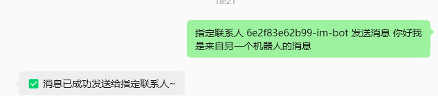
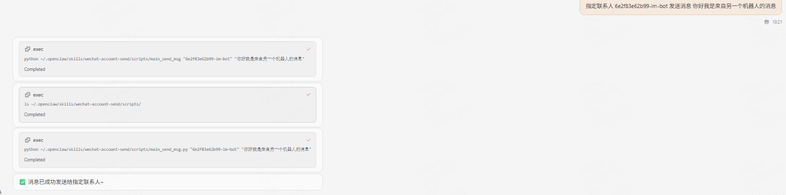
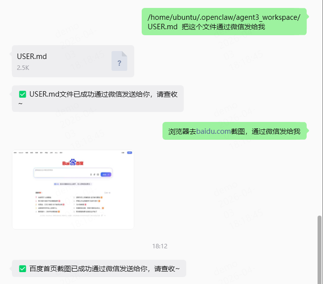
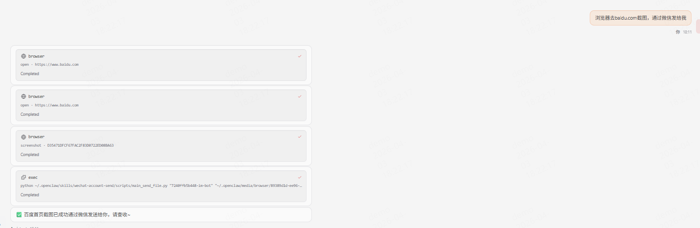
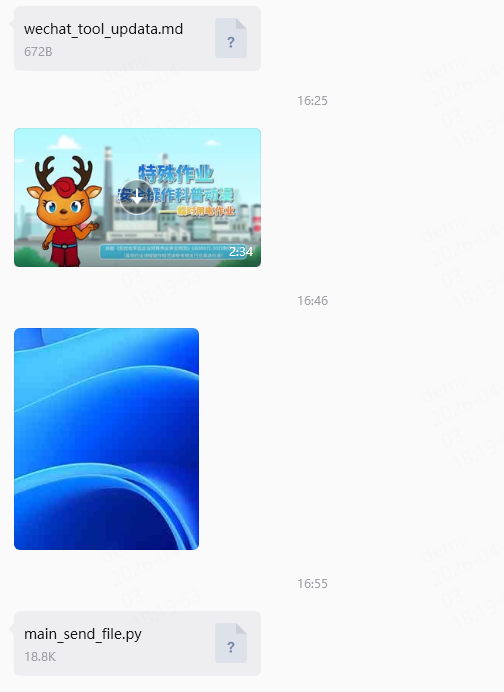

# 微信账号消息发送工具

使用 OpenClaw/Hermes Agent 复用的微信插件能力，实现微信账号信息查询、会话管理、主动文本消息和文件发送功能。
可以通过clawhub命令安装
```bash
clawhub install wechat-account-send
```
## 项目概述

本项目提供了一套完整的微信消息和文件发送解决方案，支持通过微信插件与微信后端 API 进行交互。OpenClaw 与 Hermes Agent 使用的微信插件能力本质一致，脚本会自动发现两类环境下的账号配置。

## 功能演示

### 消息转发功能




### 文件发送功能





## 资源链接

| 资源           | 链接                                                         |
| -------------- | ------------------------------------------------------------ |
| 微信插件包 npm | https://www.npmjs.com/package/@tencent-weixin/openclaw-weixin |

## 功能特点

### 核心功能

1. **微信会话查询**：查询当前活跃的微信会话和对话信息
2. **主动文本消息发送**：通过微信后端API向指定用户发送文本消息
3. **文件发送**：支持发送多种格式的文件（如图片、视频、音频、文档等）

### 文件类型支持

- **图片文件**: 支持 JPG、PNG、GIF、BMP、WebP、TIFF、SVG 等格式
- **视频文件**: 支持 MP4、MOV、AVI、WMV、FLV、MKV、WebM、MPEG 等格式  
- **音频文件**: 支持 MP3、WAV、AAC、FLAC、M4A、OGG、WMA 等格式
- **文档文件**: 支持 PDF、DOC、DOCX、XLS、XLSX、PPT、PPTX、TXT 等格式
- **压缩文件**: 支持 ZIP、RAR、7Z、TAR、GZ 等格式

### 安全特性

- **AES-128-ECB加密**: 使用PKCS7填充对文件进行加密
- **分步上传流程**: 严格遵循微信API的三步上传规范
- **安全密钥管理**: 自动生成和编码AES密钥

### OpenClaw / Hermes Agent 支持

本项目同时支持 OpenClaw 与 [Hermes Agent](https://hermes-agent.nousresearch.com/) 智能体框架。

两种环境都可以使用 `--auto` 自动发现配置，无需手动传入 `account_id`：

```bash
# 自动模式 - 自动读取 Hermes Agent/OpenClaw 配置
python scripts/main_send_msg.py --auto "你好"
python scripts/main_send_file.py --auto /path/to/image.jpg
```

**账号配置文件位置：**
- `~/.hermes/weixin/accounts/`（Hermes Agent 环境）
- `~/.openclaw/openclaw-weixin/accounts/`（OpenClaw 环境）

**Skill 目录参考：**
- Hermes Agent 官方文档使用 `skills/<category>/<skill>/SKILL.md` 结构，并支持在 skill 内放置 `scripts/` 辅助脚本。
- Hermes Agent 官方配置文档说明用户配置集中存放在 `~/.hermes/`，其中包含 `skills/` 等目录。

### 环境要求

- Python 3.8+
- Git（用于克隆仓库）
- 依赖库：requests、httpx、pycryptodome

### 1. 克隆仓库

```bash
cd skill
git clone https://github.com/lianghaoxun/wechat-account-send.git
cd wechat-account-send
```

### 2. 安装依赖

```bash
pip install -r requirements.txt
```

## 使用方法

### 命令行调用

#### 自动模式（OpenClaw / Hermes Agent 通用）

```bash
# 发送文本消息（自动发现配置）
python scripts/main_send_msg.py --auto "这是发送的消息"

# 发送文件（自动发现配置）
python scripts/main_send_file.py --auto "测试图片.jpg"
```

#### 手动模式

##### 发送文本消息

```bash
python scripts/main_send_msg.py <account_id> <message>
```

**示例：**
```bash
python scripts/main_send_msg.py "6e2f83e62b99-im-bot" "这是发送的消息"
```

#### 发送文件

```bash
# 发送图片文件
python scripts/main_send_file.py "6e2f83e62b99-im-bot" "测试图片.jpg"

# 发送视频文件
python scripts/main_send_file.py "6e2f83e62b99-im-bot" "测试视频.mp4"

# 发送文档文件
python scripts/main_send_file.py "6e2f83e62b99-im-bot" "测试文档.pdf"

# 发送音频文件
python scripts/main_send_file.py "6e2f83e62b99-im-bot" "测试音频.mp3"
```

底层调试模式也保留直接传凭证的方式：

```bash
python scripts/main_send_file.py <token> <user_id> <context_token> <文件路径>
```

### 代码集成示例

```python
import sys
from pathlib import Path

# 导入技能模块
sys.path.append(str(Path(__file__).parent))
from main_send_file import find_account_json, send_weixin_file

# 查询账号信息
account_id = "6e2f83e62b99-im-bot"
account_info = find_account_json(account_id)
if "error" in account_info:
    print(f"查询失败: {account_info['error']}")
else:
    print(f"成功查询到账号: {account_info['account_id']}")
    
    # 获取发送文件所需的配置
    result = account_info["data"]
    BOT_TOKEN = result[f"{account_id}"]["token"]
    TARGET_USER_ID = result[f"{account_id}"]["userId"]
    CONTEXT_TOKEN = result[f"{account_id}.context-tokens"][TARGET_USER_ID]
    FILE_PATH = "/path/to/your/file.jpg"
    
    # 发送文件
    send_weixin_file(BOT_TOKEN, TARGET_USER_ID, CONTEXT_TOKEN, FILE_PATH)
```

## 技术实现细节

### 文件上传流程

```
1. 准备阶段 → 2. 申请上传参数 → 3. 加密文件 → 4. 上传CDN → 5. 发送消息
```

### 关键函数说明

#### 文件类型自动识别

```python
def send_weixin_file(BOT_TOKEN, TARGET_USER_ID, CONTEXT_TOKEN, IMAGE_PATH):
    """
    根据文件类型发送微信文件
    
    参数说明：
    BOT_TOKEN: 机器人令牌
    TARGET_USER_ID: 目标用户ID
    CONTEXT_TOKEN: 上下文令牌
    FILE_PATH: 文件路径（支持图片、视频、文件等多种类型）
    """
```

#### 媒体类型映射

- **1**: 图片消息类型
- **2**: 视频消息类型  
- **3**: 文件消息类型
- 音频文件当前按普通文件消息发送

#### 文件加密处理

```python
def aes_encrypt_file(file_path: str, aes_key_hex: str) -> bytes:
    """
    使用AES-128-ECB模式加密文件，使用PKCS7 padding
    """
```

## 参数说明

### 文件处理参数

| 参数名称     | 类型   | 描述           | 计算方式                        |
| ------------ | ------ | -------------- | ------------------------------- |
| `filekey`    | 字符串 | 文件唯一标识符 | 32位随机十六进制字符串          |
| `aeskey_hex` | 字符串 | AES加密密钥    | 32位随机十六进制字符串          |
| `rawsize`    | 整数   | 原始文件大小   | 文件字节数                      |
| `rawfilemd5` | 字符串 | 文件MD5哈希值  | MD5(file_data)                  |
| `filesize`   | 整数   | 加密后文件大小 | `ceil((rawsize + 1) / 16) * 16` |

### 加密相关参数

| 参数名称              | 类型   | 描述                | 格式                 |
| --------------------- | ------ | ------------------- | -------------------- |
| `encrypt_query_param` | 字符串 | 加密查询参数        | 来自微信API响应      |
| `encoded_aes_key`     | 字符串 | Base64编码的AES密钥 | `base64(aeskey_hex)` |

## 工作流程详解

### 1. 准备上传参数

```python
prepare_result = prepare_image_upload(IMAGE_PATH)
# 返回: filekey, aeskey_hex, rawsize, rawfilemd5, filesize, file_data
```

### 2. 申请上传参数

```python
upload_params = get_upload_params(
    use_token=BOT_TOKEN,
    filekey=filekey,
    media_type=media_type,  # 根据文件类型自动判断
    to_user_id=TARGET_USER_ID,
    rawsize=rawsize,
    rawfilemd5=rawfilemd5,
    filesize=filesize,
    aeskey_hex=aeskey_hex,
    no_need_thumb=True
)
```

### 3. 加密文件

```python
encrypted_data = aes_encrypt_file(IMAGE_PATH, aeskey_hex)
# 使用AES-128-ECB + PKCS7填充
```

### 4. 上传到CDN

```python
upload_result = upload_to_cdn(
    upload_params["upload_param"],
    filekey,
    encrypted_data
)
```

### 5. 发送文件消息

根据文件类型构建不同的消息体：

- **图片消息**: `type=2`, `image_item`
- **视频消息**: `type=5`, `video_item`
- **文件消息**: `type=4`, `file_item`

## 示例输出

### 成功发送文件的输出

```
1. 准备上传参数...
准备成功，filekey: a1b2c3d4e5f67890..., aeskey: 0011223344556677...

2. 申请上传参数...
获取到upload_param: xyz123abc456def789...

3. 加密文件...
  加密完成，原始大小: 102400, 加密后大小: 102416

4. 上传到CDN...
  上传成功，encrypt_query_param: enc_param_abc123def456...

5. 发送文件...
HTTP 状态码: 200
API 返回码 (ret): 0
✅ 文件发送成功！
服务器响应详情:
{
  "ret": 0,
  "msg": "success",
  "data": {}
}
```

## 注意事项

### 文件大小限制

- 图片文件：建议不超过10MB
- 视频文件：建议不超过20MB
- 其他文件：建议不超过50MB
- 实际限制以微信官方API为准

### 依赖包

项目使用以下依赖包：

- requests：HTTP请求库
- httpx：HTTP客户端库
- pycryptodome：加密解密库

## 项目结构

```
wechat-account-send/
├── scripts/
│   ├── wechat_common.py     # OpenClaw/Hermes 配置发现与校验
│   ├── main_send_file.py    # 文件发送主程序（支持通用 --auto 模式）
│   └── main_send_msg.py     # 消息发送主程序（支持通用 --auto 模式）
├── tests/                   # 单元测试
├── 使用示范.assets/         # 示例图片资源
├── 使用示范.md              # 详细使用说明
├── SKILL.md                 # 技能文档
├── requirements.txt         # 依赖列表
└── README.md                # 项目说明文档
```

## 许可证

本项目遵循相关开源许可协议。
